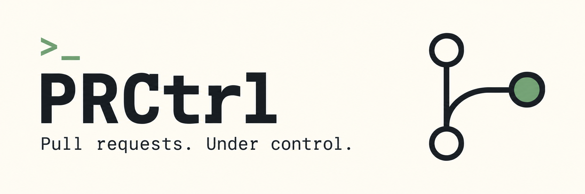
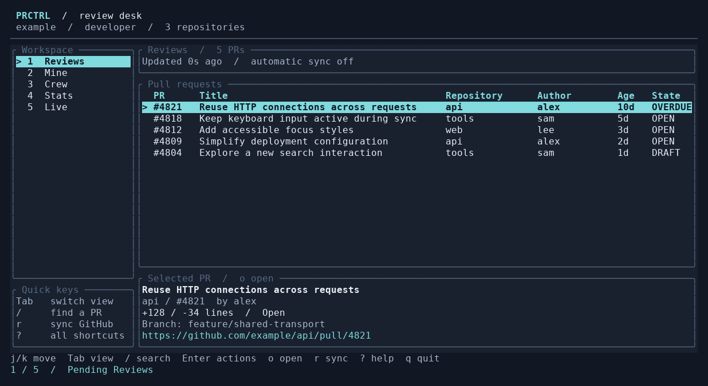

# PRCtrl

> **Terminal-native GitHub PR management. Stay on top of code reviews without leaving your terminal.**

PRCtrl helps engineering teams manage PR reviews efficiently. Monitor incoming PRs, get smart notifications, integrate with AI for instant triage, and now with a **rich Terminal UI mode** — all from the command line.

[](https://crates.io/crates/prctrl)
[](https://crates.io/crates/prctrl)


[](https://jeremysomsouk.github.io/prctrl/)

## What It Does

```
$ prctrl list

  3 pending reviews

  [1] feat: add CSV export        #4821  alice    backend    +120/-30   2 days
  [2] fix: authentication bug     #3156  bob      frontend   +45/-12    1 day
  [3] refactor: API client        #3102  charlie  backend   +280/-90   4 days
```

**Core features:**
- **List & filter** PRs across repos, teams, and authors
- **Monitor** for new PRs with native macOS notifications
- **Delegate** triage to Claude for instant recommendations
- **Track** review history and team metrics
- **Stack detection** automatically identifies PRs that build on each other
- **Terminal UI mode** for interactive PR management with auto-refresh
- **Smart caching** to reduce GitHub API calls

## Quick Start

```bash
# Install
cargo install prctrl

# Configure
prctrl config init

# List pending reviews
prctrl list

# Launch Terminal UI mode
prctrl tui

# Monitor for new PRs (background)
prctrl monitor
```

## Installation

### From Source
```bash
cargo install --git https://github.com/JeremySomsouk/prctrl
```

### Requirements
- Latest stable Rust (tested in CI; a minimum supported Rust version is not currently declared)
- GitHub personal access token (read access to PRs)
- macOS (for native notifications)

## Configuration

Run the interactive setup to configure PRCtrl:

```bash
prctrl config init
```

This creates a config file at `~/.prctrl/config.toml` with your GitHub settings.

**Example configuration:**

```toml
# ~/.prctrl/config.toml

[github]
token = "ghp_xxxxxxxxxxxxxxxxxxxx"
username = "john_doe"
org = "my-company"
repos = ["frontend", "backend", "mobile"]
teams = ["platform", "backend"]  # optional
crew_members = ["alice", "bob", "carol"]  # optional
exclude_prefix = ["chore(deps)", "renovate"]  # optional: filter out dependency PRs
max_pr_age_days = 60  # optional: only show PRs from the last 60 days
```

**Getting a GitHub Token:**

1. Go to GitHub → Settings → Developer Settings → Personal Access Tokens
2. Generate New Token (Classic)
3. Select scopes: `repo`, `read:user`, `notifications`
4. Copy the token and add it to your config

**Configuring PR Filtering**

You can filter which PRs appear in your lists:

```toml
[github]
# ... required fields above ...

# Filter out dependency update PRs (default: ["chore(deps)"])
exclude_prefix = ["chore(deps)", "renovate", "dependabot"]

# Only show PRs created in the last N days (default: 60)
max_pr_age_days = 30
```

**Optional: Configure Crew Members**

The `crew` feature filters PRs to show only those from your team members:

```toml
[github]
# ... required fields above ...
crew_members = ["alice", "bob", "carol"]
```

**Alternative: Environment Variables**

Instead of a config file, you can use environment variables:

| Variable | Description |
|----------|-------------|
| `PRCTRL_GITHUB_TOKEN` | GitHub personal access token |
| `PRCTRL_GITHUB_USERNAME` | Your GitHub username |
| `PRCTRL_GITHUB_ORG` | GitHub organization name |
| `PRCTRL_GITHUB_REPOS` | Repos to monitor (comma-separated) |
| `PRCTRL_GITHUB_TEAMS` | Teams to filter (optional) |
| `PRCTRL_ANTHROPIC_API_KEY` | For Claude integration (optional) |
| `PRCTRL_MAX_PR_AGE_DAYS` | Max PR age in days (default: 60) |
| `MAX_PR_AGE_DAYS` | Alternative name for max PR age |

## CLI Reference

| Command | Description |
|---------|-------------|
| `prctrl list` | List pending reviews |
| `prctrl mine` | Your own open PRs |
| `prctrl top` | Highest priority PRs |
| `prctrl delegate [pr]` | AI triage with Claude |
| `prctrl chat` | Interactive chat with Claude |
| `prctrl monitor` | Background monitoring |
| `prctrl tui` | **Terminal UI mode** (interactive) |
| `prctrl approve <pr>` | Quick approve |
| `prctrl chase <pr>` | Follow up stale PRs |
| `prctrl stats` | Team review metrics |

See `prctrl --help` for full command list.

## Terminal UI Mode (TUI)

A responsive review desk for browsing GitHub pull requests:



```bash
prctrl tui                   # Sync every 30 seconds
prctrl tui --interval 60     # Sync every minute
prctrl tui --interval 0      # Manual sync only
NO_COLOR=1 prctrl tui        # Monochrome, with textual status and selection markers
```

### Views

| Key | View | Contents |
|-----|------|----------|
| `1` | Reviews | PRs requesting your review, including configured teams |
| `2` | Mine | Your open PRs, including drafts |
| `3` | Crew | Open PRs by configured crew members; falls back to Reviews if no crew is configured |
| `4` | Stats | Summary of the Reviews snapshot, before the local text filter |
| `5` | Live | Reviews with a fresh GitHub sync on entry |

Network requests run in the background. You can navigate or quit during a sync. Related views share data and in-flight requests; each preload becomes available independently. Existing results remain visible while refreshing or after a failed sync. Manual and periodic refreshes request fresh data; switching ordinary views can use a snapshot cached for up to 60 seconds.

Wide terminals show a sidebar; smaller terminals use numbered tabs. The selected PR's title, repository, author, branch, URL and changes appear in a details panel when space permits. `DRAFT`, `OPEN` and `OVERDUE` labels convey status without relying on color. `OVERDUE` means the PR was opened more than seven days ago.

### Keyboard

| Key | Action |
|-----|--------|
| `Up` / `k`, `Down` / `j` | Move through PRs |
| `PageUp`, `PageDown` | Move ten PRs |
| `Home`, `End` | First or last filtered result |
| `Tab`, `Shift+Tab`, `1`–`5` | Switch views |
| `/` | Edit the filter by title, author, repository or number |
| `Enter` while filtering | Apply the filter and return to navigation |
| `Esc` while filtering | Restore the previous filter |
| `Esc`, `Ctrl+F` outside filtering | Clear the filter |
| `Enter` on a PR | Show available actions |
| `o` | Launch the selected PR in your browser |
| `r`, `Ctrl+R` | Sync fresh data from GitHub |
| `?` | Open keyboard help |
| `Esc` | Close the focused panel or dismiss a notice |
| `q`, `Ctrl+C` | Quit; `q` remains text while editing the filter |

The action menu offers browser launch and returning to the list. Review, approval, diff and AI actions remain available through the CLI; the TUI does not report placeholder actions as successful.

To generate synthetic preview cells without contacting GitHub, run `cargo run --example tui_preview -- /tmp/prctrl-preview.json 120 32`.

## Workflow Example

```bash
# Morning: See what needs attention
prctrl list --priority

# Quick: Approve trivial PRs
prctrl approve 4821

# Deep work: Delegate triage to AI
prctrl delegate

# Interactive: Browse PRs in the review desk
prctrl tui

# End of day: Check team stats
prctrl team-summary
```

## Smart Caching

PRCtrl includes an intelligent caching system that:

- **Reduces API Calls**: Caches PR data to minimize GitHub rate limit usage
- **Auto-Expiration**: Cache entries expire after 60 seconds by default
- **Smart Invalidation**: Monitor Live tab always fetches fresh data
- **Tab Preloading**: All tabs are preloaded in the background for instant switching
- **Efficient Storage**: Thread-safe cache with proper memory management

### Cache Configuration

The cache TTL can be configured programmatically. The default is 60 seconds for most operations.

## Integrations

### Claude Integration
```bash
# Get AI-powered review summary
prctrl delegate 4821

# Uses your existing Claude Code CLI
# Configure instructions in ~/.prctrl/instruction.md
```

### Interactive Chat
```bash
# Chat with Claude about your PRs
prctrl chat

# Chat about a specific PR
prctrl chat --pr 4821
```

The `chat` command launches an interactive Claude Code session with context about PRCtrl commands. Ask questions about PRs, get recommendations on what to review, or learn how to use PRCtrl features.

## Stack Detection

PRCtrl automatically detects **stacked PRs** — PRs that build on each other through branch relationships. This helps you identify dependent PRs that need to be reviewed in sequence.

### How it works

Stack detection analyzes branch relationships:
- PR A targets branch `feature`
- PR B targets branch `feature-2` (or builds on `feature`)
- This creates a stack: `feature` → `feature-2`

### Usage

```bash
# Show stacked PRs in your own PRs (automatic)
prctrl mine

# Show stacked PRs in pending reviews (opt-in)
prctrl list --show-stacks
```

### Example Output

```
┌─ Stack on `main` (3 PRs)

🔵 #123 - Add new feature
  └─ @feature
    https://github.com/owner/repo/pull/123

  #124 - Implement API endpoint
  └─ @feature-2
    https://github.com/owner/repo/pull/124

  #125 - Add tests
  └─ @feature-3
    https://github.com/owner/repo/pull/125
```

The blue dot (🔵) indicates the base PR of each stack.

## Documentation

- [Full Documentation](https://jeremysomsouk.github.io/prctrl/) — User guide and command reference
- [CONTRIBUTING.md](./CONTRIBUTING.md) — How to contribute to PRCtrl
- [TROUBLESHOOTING.md](./TROUBLESHOOTING.md) — Common issues and solutions

Issues and PRs welcome!

## License

MIT
